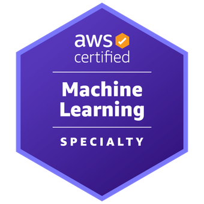

# Data Scientist Portfolio  

---
## 💼 Professional Experience

  <table>
    <tr>
      <td style="width: 300px; text-align: center; vertical-align: top;">
        
         
        <strong>Machine Learning Software Engineer Intern</strong>
         
        <em>Open Bionics</em>
         
        <ul style="text-align: left;">
          <li><strong>Project Focus:</strong> sEMG Time-Series Analysis</li>
          <li>Spearheaded LSTM and RNN models, achieving 96% motion recognition accuracy for 10 motions.</li>
        </ul>
      </td>
      <td style="width: 300px; text-align: center; vertical-align: top;">
        
         
        <strong>Computer Vision Intern</strong>
         
        <em>Bristol Robotics Laboratory</em>
         
        <ul style="text-align: left;">
          <li><strong>Project Focus:</strong> Automated Quality Control</li>
          <li>Developed a machine vision system for defect detection and automated data collection.</li>
        </ul>
      </td>
      <td style="width: 300px; text-align: center; vertical-align: top;">
        
         
        <strong>Machine Learning Intern</strong>
         
        <em>Bristol Robotics Laboratory</em>
         
        <ul style="text-align: left;">
          <li><strong>Project Focus:</strong> Human-Robot Interaction</li>
          <li>Engineered models for subject and condition classification during robot-assisted motion.</li>
        </ul>
      </td>
    </tr>
  </table>

---

## 🚀 Projects

  <table>
    <tr>
      <td style="width: 200px; text-align: center; vertical-align: top;">
        
         
        <strong>Advanced Robotics Research</strong>
         
        Robot Intelligence Lab, Imperial College London
         
        Key Outcome: <em>Achieved X improvement in Y through Z.</em>
      </td>
      <td style="width: 200px; text-align: center; vertical-align: top;">
        
         
        <strong>Automated Quality Control</strong>
         
        Bristol Robotics Laboratory
         
        Key Outcome: <em>Reduced defect rates by X% using innovative ML solutions.</em>
      </td>
    </tr>
  </table>

---

## 🎓 Education

  <table>
    <tr>
      <td style="width: 300px; text-align: center; vertical-align: top;">
        
         
        <strong>MSc Human and Biological Robotics</strong>
         
        <em>Imperial College London</em>
         
        <ul style="text-align: left;">
          <li>Graduated with Merit.</li>
          <li>Specialized in advanced robotics and machine learning applications.</li>
        </ul>
      </td>
      <td style="width: 300px; text-align: center; vertical-align: top;">
        
         
        <strong>BEng Robotics Engineering</strong>
         
        <em>University of the West of England, Bristol</em>
         
        <ul style="text-align: left;">
          <li>Graduated with First-Class Honours.</li>
          <li>Focused on applied robotics and embedded systems.</li>
        </ul>
      </td>
    </tr>
  </table>

---

## 🏆 Certifications

  <table>
    <tr>
      <td style="width: 200px; text-align: center; vertical-align: top;">
        
         
        <strong>Professional Machine Learning Engineer Certification</strong>
         
        Google Cloud 
        <a href="https://www.credly.com/badges/75c1d277-9725-4c95-a295-93ac103cd3d0/linked_in_profile">View Certification</a>
      </td>
      <td style="width: 200px; text-align: center; vertical-align: top;">
        
         
        <strong>Tableau Certified Data Analyst</strong>
         
        Tableau 
        <a href="https://example-link-to-tableau-cert">View Certification</a>
      </td>
      <td style="width: 200px; text-align: center; vertical-align: top;">
        
         
        <strong>AWS Certified Machine Learning – Specialty</strong>
         
        Amazon Web Services 
        <a href="https://example-link-to-aws-cert">View Certification</a>
      </td>
    </tr>
  </table>

---

## 📜 Certificates of Completion

  <table>
    <tr>
      <td style="width: 200px; text-align: center; vertical-align: top;">
        
         
        <strong>Google Data Analytics Professional Certificate</strong>
         
        Coursera 
        <a href="https://www.credly.com/badges/8b8e6990-a72b-40d3-bb31-82b2dd6c05e1/public_url">View Certificate</a>
      </td>
      <td style="width: 200px; text-align: center; vertical-align: top;">
        
         
        <strong>PostgreSQL 12 Associate</strong>
         
        EnterpriseDB 
        <a href="https://example-link-to-postgres-cert">View Certificate</a>
      </td>
    </tr>
  </table>

---

## 🌟 Groups & Societies

  <table>
    <tr>
      <td style="width: 300px; text-align: center; vertical-align: top;">
        
         
        <strong>Machine Learning Lead and Educator</strong>
         
        <em>Imperial College London Prosthetics Society</em>
         
        <em>Oct 2022 – Apr 2024</em>
         
        <ul style="text-align: left;">
          <li>Directed the development of the first ML-powered prosthetic.</li>
          <li>Delivered comprehensive educational sessions on ML and control algorithms.</li>
        </ul>
      </td>
      <td style="width: 300px; text-align: center; vertical-align: top;">
        
         
        <strong>Peer Assisted Learning Leader</strong>
         
        <em>Bristol, University of the West of England</em>
         
        <em>Sep 2020 – Sep 2022</em>
         
        <ul style="text-align: left;">
          <li>Facilitated study support sessions for 60+ engineering students.</li>
          <li>Boosted comprehension of mathematical and engineering concepts.</li>
        </ul>
      </td>
      <td style="width: 300px; text-align: center; vertical-align: top;">
        
         
        <strong>HEARTS (Healthcare Engineering and Assistive Robotics Technology and Services)</strong>
         
        <em>Robotic Dog Development</em>
         
        <ul style="text-align: left;">
          <li>Developed a robotic dog as a home assistant.</li>
          <li>Designed innovative solutions for healthcare robotics and services.</li>
        </ul>
      </td>
    </tr>
  </table>

